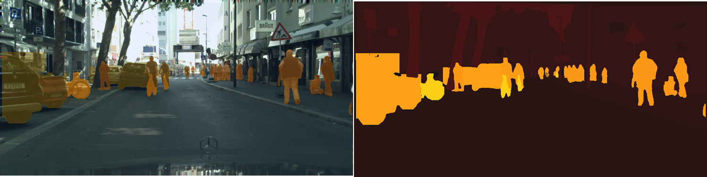

# Panoptic Segmentation

Panoptic Segmentation is an emerging field in computer vision that aims to provide a more comprehensive understanding of the scene by unifying the tasks of semantic segmentation and instance segmentation. It aims to unify the traditional semantic segmentation, which groups pixels into classes, and instance segmentation, which distinguishes individual objects within those classes. The main goal of panoptic segmentation is to provide a complete and detailed representation of the visual environment, which is crucial for many applications such as autonomous driving, robotics, and augmented reality. This project implements a location-based panoptic segmentation model by modifying the state-of-the-art EfficientPS architecture to use SOLOv2 as the instance segmentation head rather than a Mask-RCNN.

## Approach Used
In this approach, we have replaced the Mask-RCNN architecture from the instance head with a SOLOv2 architecture to improve the instance segmentation of the EfficientPS model. The Mask-RCNN losses are replaced by SOLOv2's focal losses for semantic category classification and DiceLoss for mask prediction.

## Results

